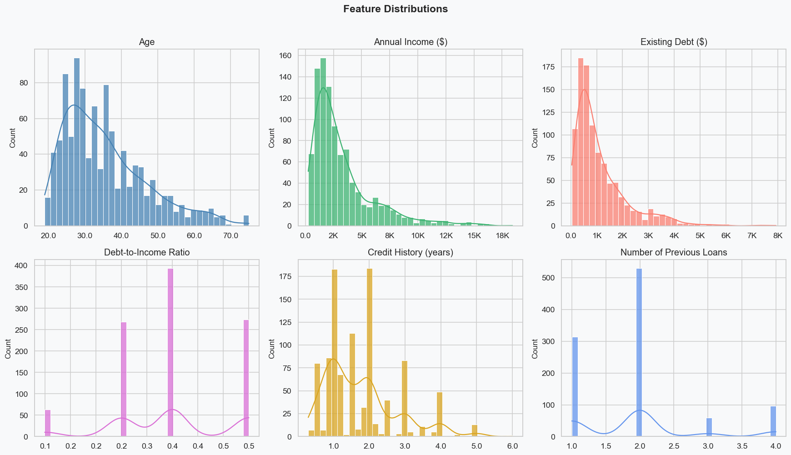
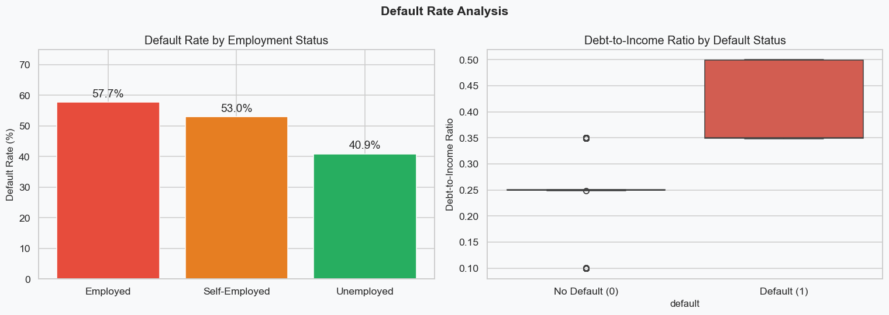
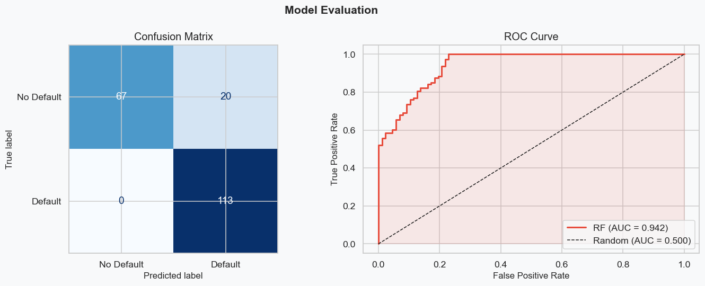
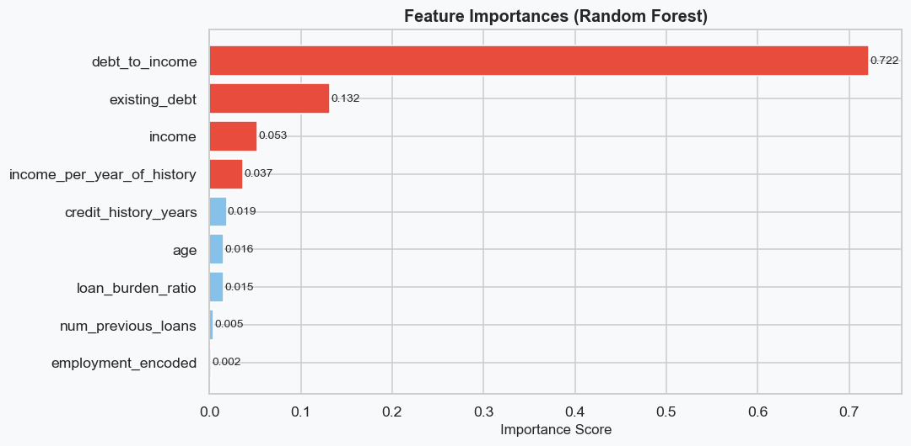

# Credit Risk Analysis & Loan Decision System

End-to-end **credit risk modeling** project in a single Jupyter Notebook: data preparation, EDA, ML classification, and a simple **business-rule loan decision engine** that turns model risk into interest rate + credit limits.

> Main notebook: `credit_risk_analysis.ipynb`

## What’s inside

- **Dataset loading & mapping** (German Credit dataset-style schema)
- **Cleaning & feature engineering**
  - `debt_to_income`
  - `loan_burden_ratio`
  - `income_per_year_of_history`
- **Exploratory Data Analysis (EDA)**
- **Model training & evaluation**
  - Random Forest classifier
  - Metrics: Accuracy, ROC-AUC, confusion matrix, ROC curve
  - Feature importance
- **Business logic layer**
  - Risk tiers (Very Low → Very High)
  - Interest rate assignment
  - Maximum credit and maximum duration rules
  - Loan amortization simulation
- **Interactive borrower simulation** (`evaluate_borrower()`)

## Repository structure

- `credit_risk_analysis.ipynb` — the full analysis + decision engine
- `img/` — plots exported from the notebook
  - `eda_distributions.png`
  - `eda_default_analysis.png`
  - `eda_income_credit.png`
  - `eda_correlation.png`
  - `model_evaluation.png`
  - `feature_importance.png`
  - `risk_surface.png`

## Quickstart

### 1) Clone

```bash
git clone https://github.com/wassim-bahloul/credit_risk_analysis.git
cd credit_risk_analysis
```

### 2) Create an environment (recommended)

```bash
python -m venv .venv
source .venv/bin/activate  # Windows: .venv\Scripts\activate
```

### 3) Install dependencies

If you don’t have a `requirements.txt` yet, this project typically needs:

```bash
pip install numpy pandas matplotlib seaborn scikit-learn notebook
```

### 4) Run the notebook

```bash
jupyter notebook
```

Open `credit_risk_analysis.ipynb` and run all cells.

## Results (high level)

The notebook produces:
- EDA figures saved to `img/`
- Model performance summary (accuracy + ROC-AUC + confusion matrix)
- A simple lending policy simulation that converts **predicted default probability** into:
  - a risk tier
  - an interest rate
  - a max credit amount
  - a max safe duration

## Decision engine (how it works)

1. A borrower profile is transformed into model features (including engineered ratios).
2. The model outputs a **risk score** (default probability) in **0–100%**.
3. The score is mapped to a **risk tier** that controls:
   - annual interest rate
   - maximum term length
   - maximum credit multiplier vs. income
4. A loan is simulated with standard amortization to compute monthly payment, total repayment, and bank profit.

## Example: evaluate a borrower

Inside the notebook, you can run something like:

```python
profile = {
    "age": 35,
    "income": 5500,
    "existing_debt": 1200,
    "employment_status": "Employed",
    "credit_history_years": 4,
    "num_previous_loans": 2,
}

evaluate_borrower(profile, desired_duration=48, requested_loan=15000)
```

## Visuals

### Feature distributions



### Default rate analysis



### Model evaluation



### Feature importance



## Notes / assumptions

- The notebook includes **proxy mappings** to align dataset columns with the project schema (see the “Dataset Loading” section in the notebook).
- This project is intended for **learning / demonstration** (not production underwriting).

## License

No license file is included yet. If you want to make the repo easier to reuse, consider adding an open-source license (e.g., MIT).
